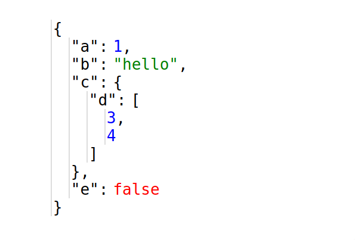

# vue-print-object

> A component to print and collapse javascript objects

[](https://badge.fury.io/js/vue-print-object)



[Codepen](https://codepen.io/cars10/pen/yjWdQv)


## Features

* Print javascript objects
* Highlighting of different types (number, string, boolean, etc)
* Collapsible: collapse keys
* Highlight of complete objects on hover


## Installation

### Via npm

First add it to your `package.json`:

```bash
npm install vue-print-object --save
# or yarn
yarn add vue-print-object
```


### Or manually via `<script>` tag

If you don't use npm you can download the minified version in `dist/vue-print-object.min.js` and the css in `dist/vue-print-object.css`, then add it to your site:

```html
<link rel="stylesheet" href="vue-print-object.css">
<script src="vue-print-object.min.js"></script>
```

Loading the minified version will automatically register the component `VuePrintObject` globally on the browsers `window` object.

## Usage

Import the component js and css (alternatively copy and customize the css):

```javascript
import PrintObject from 'vue-print-object'
```

```javascript
import 'vue-print-object/dist/vue-print-object.css'
```

Then load the component:

```javascript
// globally
Vue.use(PrintObject)

// or in a component
export default {
  components: {
    PrintObject
  }
}
```

Finally use the component:

```html
<print-object :printable-object="myObject"></print-object>
```

```javascript
export default {
  data: () => {
    myObject: {
      a: 1,
      b: "hello",
      c: {
        d: [3, 4]
      },
      e: false
    }
  }
}
```
[Codepen](https://codepen.io/cars10/pen/yjWdQv)

## License

MIT
